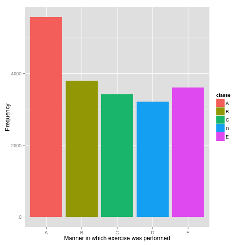

###Background

>Using devices such as Jawbone Up, Nike FuelBand, and Fitbit it is now possible to collect a large amount of data about personal activity relatively inexpensively. These type of devices are part of the quantified self movement – a group of enthusiasts who take measurements about themselves regularly to improve their health, to find patterns in their behavior, or because they are tech geek. One thing that people regularly do is quantify how much of a particular activity they do, but they rarely quantify how well they do it. In this project, your goal will be to use data from accelerometers on the belt, forearm, arm, and dumbell of 6 participants. They were asked to perform barbell lifts correctly and incorrectly in 5 different ways. More information is available from the website here: http://groupware.les.inf.puc-rio.br/har (see the section on the Weight Lifting Exercise Dataset). 

The goal of this project is to build a model that can predict the manner in which an exercise was performed - given by the "classe" variable in the training dataset - via the other variables in the dataset.

###Building the model

The first step is to load the required libraries:


```r
library(caret)
library(ggplot2)
library(randomForest)

startTime <- Sys.time() #Track the start and finish times
```

Then get the datasets, either take them from the working directory if already present, or else download them from the given internet locations:


```r
getDataset <- function(URL="", destFile=""){
  if(!file.exists(destFile)){
    download.file(URL, destFile, method="curl")
  }
}

trainURL <- "https://d396qusza40orc.cloudfront.net/predmachlearn/pml-training.csv"
testURL <- "https://d396qusza40orc.cloudfront.net/predmachlearn/pml-testing.csv"

getDataset(trainURL, "pml-training.csv")
getDataset(testURL, "pml-testing.csv")
```

Read the data into R data frames, noted from observation that missing data is either blank or already contains an "NA" string:


```r
training <- read.csv("pml-training.csv", na.strings = c("NA", ""))
testing  <- read.csv("pml-testing.csv", na.strings = c("NA", ""))
```

This gives us **19622** obervations of **160** variables. This many variables will make training a model computationally intensive. Basic exploration also shows that many of the columns are largely NA values and the first six have no useful predictive value (usernames, time of exercise etc).

In order to clean up the dataset into a more manageable format the first six columns are dropped, along with any that contains more than 95% NA values.


```r
training <- training[-c(1:6)]
training <- training[!(colSums(is.na(training)) > (dim(training)[1] * .95))]

testing   <- testing[-c(1:6)]       
testing   <- testing[!(colSums(is.na(testing)) > (dim(training)[1] * .95))]        
```

A quick look at the distribution of the "classe" variable in the tidied dataset...


```r
qplot(classe, data=training, fill=classe, xlab = "Manner in which exercise was performed", ylab = "Frequency")
```

 

..shows that the data is skewed somewhat towards 'A', which could have an impact on classifier training. 

This leaves **19622** obervations of **54** variables. The data is then partitioned into 60% training and 40% testing, standard ratios.


```r
partition <- createDataPartition(training$classe, p = 0.6, list = FALSE)
training  <- training[partition, ]
trainingTest   <- training[-partition, ]
```

Now the model is built on the training dataset using Random Forests with 10-fold cross-validation:


```r
trainParameters <- trainControl(allowParallel = TRUE, method = "cv", number = 10)
model <- train(classe ~ ., data = training, method = "rf", 
               trControl = trainParameters)
```

###Use of Cross-Validation

K-fold cross-validation is used in the training parameters, k is set to the commonly used value of 10.

###Sampling Errors

Testing the prediction accuracy of the model against the training partition gives the in sample error rate:


```r
inSample <- confusionMatrix(predict(model, training), training$classe)
accuracy <- round(inSample$overall[1], 3); errorRate <- 1 - accuracy
accuracyPC <- accuracy * 100; errorRatePC <- errorRate * 100
print(inSample)
```

```
## Confusion Matrix and Statistics
## 
##           Reference
## Prediction    A    B    C    D    E
##          A 3348    0    0    0    0
##          B    0 2279    0    0    0
##          C    0    0 2054    0    0
##          D    0    0    0 1930    0
##          E    0    0    0    0 2165
## 
## Overall Statistics
##                                      
##                Accuracy : 1          
##                  95% CI : (0.9997, 1)
##     No Information Rate : 0.2843     
##     P-Value [Acc > NIR] : < 2.2e-16  
##                                      
##                   Kappa : 1          
##  Mcnemar's Test P-Value : NA         
## 
## Statistics by Class:
## 
##                      Class: A Class: B Class: C Class: D Class: E
## Sensitivity            1.0000   1.0000   1.0000   1.0000   1.0000
## Specificity            1.0000   1.0000   1.0000   1.0000   1.0000
## Pos Pred Value         1.0000   1.0000   1.0000   1.0000   1.0000
## Neg Pred Value         1.0000   1.0000   1.0000   1.0000   1.0000
## Prevalence             0.2843   0.1935   0.1744   0.1639   0.1838
## Detection Rate         0.2843   0.1935   0.1744   0.1639   0.1838
## Detection Prevalence   0.2843   0.1935   0.1744   0.1639   0.1838
## Balanced Accuracy      1.0000   1.0000   1.0000   1.0000   1.0000
```

With an in sample accuracy of 1 (100%) we have an in sample error of 0 (0%).

And testing the prediction accuracy of the model against the testing partition gives the out of sample error:


```r
outSample <- confusionMatrix(predict(model, trainingTest), trainingTest$classe)
accuracy <- round(outSample$overall[1], 3); errorRate <- 1 - accuracy
accuracyPC <- accuracy * 100; errorRatePC <- errorRate * 100
print(outSample)
```

```
## Confusion Matrix and Statistics
## 
##           Reference
## Prediction    A    B    C    D    E
##          A 1321    0    0    0    0
##          B    0  931    0    0    0
##          C    0    0  833    0    0
##          D    0    0    0  755    0
##          E    0    0    0    0  867
## 
## Overall Statistics
##                                      
##                Accuracy : 1          
##                  95% CI : (0.9992, 1)
##     No Information Rate : 0.2806     
##     P-Value [Acc > NIR] : < 2.2e-16  
##                                      
##                   Kappa : 1          
##  Mcnemar's Test P-Value : NA         
## 
## Statistics by Class:
## 
##                      Class: A Class: B Class: C Class: D Class: E
## Sensitivity            1.0000   1.0000    1.000   1.0000   1.0000
## Specificity            1.0000   1.0000    1.000   1.0000   1.0000
## Pos Pred Value         1.0000   1.0000    1.000   1.0000   1.0000
## Neg Pred Value         1.0000   1.0000    1.000   1.0000   1.0000
## Prevalence             0.2806   0.1978    0.177   0.1604   0.1842
## Detection Rate         0.2806   0.1978    0.177   0.1604   0.1842
## Detection Prevalence   0.2806   0.1978    0.177   0.1604   0.1842
## Balanced Accuracy      1.0000   1.0000    1.000   1.0000   1.0000
```

With an out of sample accuracy of 1 (100%) we have an in sample error of 0 (0%).

With accuracy and error rates like this the model should be able to accurately predict all 20 of the tests in the testing data 


```r
predict(model, testing)
```

```
##  [1] B A B A A E D B A A B C B A E E A B B B
## Levels: A B C D E
```

And these answers have all evaluated to correct against the submission page.

###Choices Made

*Data cleansing* Probably the singlemost significant choice is how much of the original data to retain in the training set that will be used to build the model. Exploratory analysis revealed that those columns that had any NA values invariably had more than 95% at NA, so in practice I could have set the NA threshold to zero. Eliminating all NA values at first seemed a little drastic, however the remaining 54 variables proved more than enough to supply the 98~99% accuracy. Experiments with imputing missing data actually lowered the accuracy rates and so were left out of the final version.

*Training algorithm* There are dozens of training algorithms to choose from in the caret package. Although in theory any of them should be able to produce the same results, I stuck with Random Forests as it is most familiar to me having been covered in the course lectures. Also attempts at using other algorithms either results in much lower accuracy rates (~76% - 84%) or bombed out with errors after being left to run for extended periods. As the model building can be time consuming I didn't have the time to invest in anything I wasn't already sure would work.

*Cross validation* The question of how many folds to use is a tricky one. I used 10 in the final submission, which causes the training to take about 20 mins on my computer. I've found just keeping it at 4 (around 6 minutes) gives me an accuracy of ~94-96% so there's a definitive drop in return on investment as you add more folds in this case, though again I didn't have time to make many runs and quantify the best tradeoff in accuracy versus time (which is presumably only really relevant to my machine anyway)


```r
Sys.time() - startTime # Length of run...
```

```
## Time difference of 15.85295 mins
```
